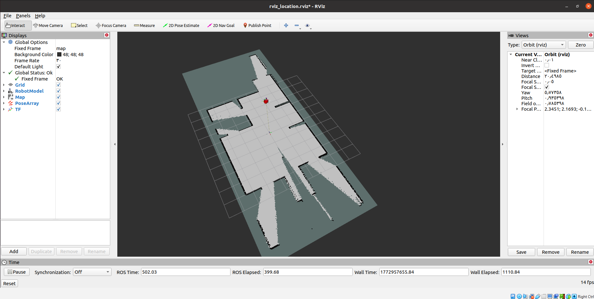
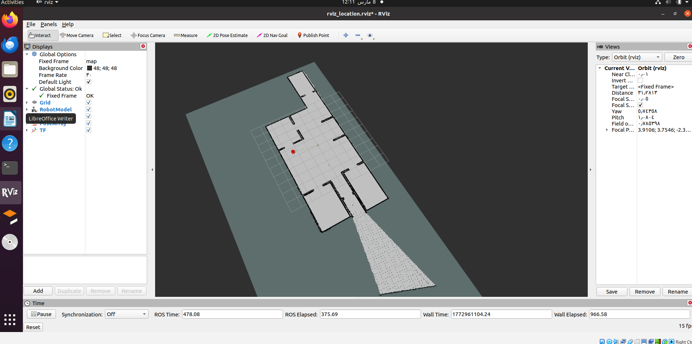
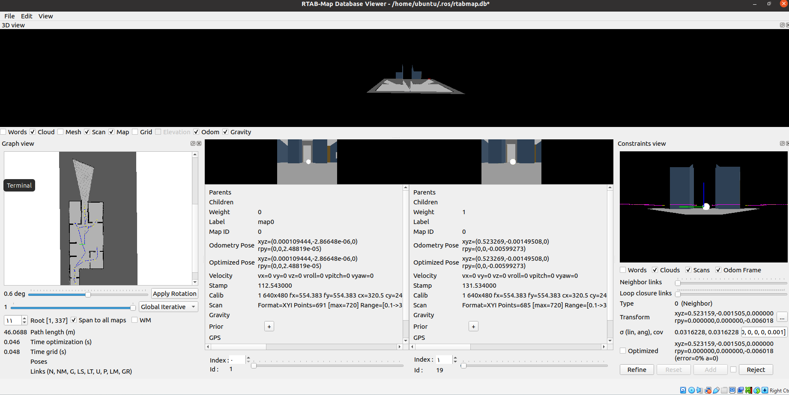
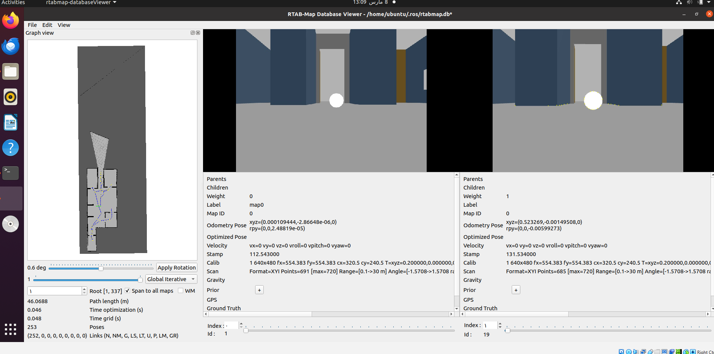
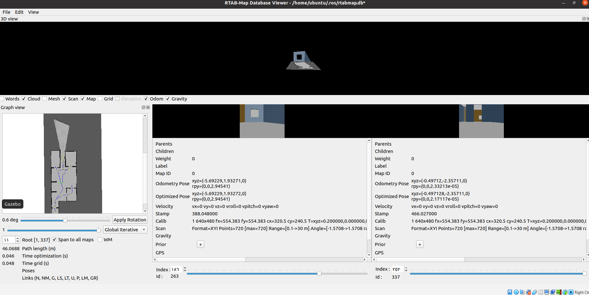
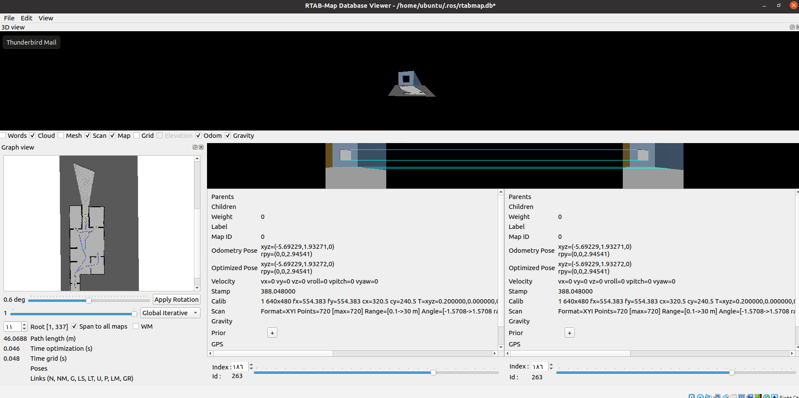

# Map-My-World Project

In this project you will create a 2D occupancy grid and 3D octomap from a simulated environment using your own robot with the RTAB-Map package.
RTAB-Map (Real-Time Appearance-Based Mapping) is a popular solution for SLAM to develop robots that can map environments in 3D. RTAB-Map has good speed and memory management, and it provides custom developed tools for information analysis. Most importantly, the quality of the documentation on ROS Wiki (http://wiki.ros.org/rtabmap_ros) is very high. Being able to leverage RTAB-Map with your own robots will lead to a solid foundation for mapping and localization well beyond this Nanodegree program.
For this project we will be using the rtabmap_ros package, which is a ROS wrapper (API) for interacting with RTAB-Map. Keep this in mind when looking at the relative documentation.

---


---


---


---


##  System Requirements

- Ubuntu 20.04  
- ROS Noetic  
- Gazebo  
- Git  

---

## Create Catkin Workspace

```bash
mkdir -p ~/catkin_ws/src
cd ~/catkin_ws
catkin_make
source devel/setup.bash
```
## Clone Repository

```bash
cd ~/catkin_ws/src
git clone https://github.com/jamal2134/Map-My-World.git
```

## Install RTAB-Map Package

1. Prerequisites
Ensure your ROS Noetic environment is up to date:

```bash
sudo apt update && sudo apt upgrade
```

2. Install RTAB-Map Standalone Library
The ROS wrapper requires the base RTAB-Map library to be installed on the system first.

```bash
cd ~
git clone https://github.com/introlab/rtabmap.git
cd rtabmap/build
cmake ..
make -j$(nproc)
sudo make install
sudo ldconfig
```

3. Install RTAB-Map ROS Wrapper (Noetic)
Clone the ROS wrapper into your catkin workspace. Note: We must use the noetic-devel branch for compatibility with ROS 1.

```bash
cd ~/catkin_ws/src
git clone https://github.com/introlab/rtabmap_ros.git
cd rtabmap_ros
git checkout noetic-devel
cd ../..
```

4. Build the Workspace
Install any missing dependencies using `rosdep` and build the packages:

```bash
rosdep install --from-paths src --ignore-src -r -y
catkin_make -j$(nproc)
source devel/setup.bash
```


## Install Teleop Package
1. Clone teleop package:
```bash
cd /home/workspace/catkin_ws/src
git clone https://github.com/ros-teleop/teleop_twist_keyboard
```
2. Build:

```bash
cd ..
catkin_make
source devel/setup.bash
```

3.Run teleoperation:
```bash
rosrun teleop_twist_keyboard teleop_twist_keyboard.py

```

## Build Workspace

```bash
cd ~/catkin_ws
catkin_make
source devel/setup.bash
```


## Running the Project
- Terminal 1 — Launch Gazebo World
```bash
roslaunch my_robot world.launch
```
- Terminal 2 — Launch RTAB-Map
```bash
roslaunch location mapping.launch
```
- Terminal 3 — Keyboard Control
```bash
rosrun teleop_twist_keyboard teleop_twist_keyboard.py
```
- Optional: RTAB-Map Localization
```bash
roslaunch location localization.launch
```

## Mapping: Database Viewer

Database Analysis
The rtabmap-databaseViewer is a great tool for exploring your database when you are done generating it. It is isolated from ROS and allows for complete analysis of your mapping session.

This is how you will check for loop closures, generate 3D maps for viewing, extract images, check feature mapping rich zones, and much more!

```bash
rtabmap-databaseViewer ~/.ros/rtabmap.db
```
* Say yes to using the database parameters
* View -> Constraint View
* View -> Graph View

---


---


---


---
## Google Drive Link
Therefore, the RTAB-Map database file and 3D Colored Point Cloud Map have been uploaded to Google Drive. You can download it using the link below:

(https://drive.google.com/drive/folders/1ZgoVFMTOIttTo4g2p07CoGNjzHJ4-vRo?usp=sharing)

## View RTAB-Map Database

```bash
rtabmap-databaseViewer rtabmap.db
```

## View 3D Colored Point Cloud Map
The generated 3D map is exported as a PCD (Point Cloud Data) file.

This file represents the reconstructed environment as a colored point cloud generated from RGB-D data.

* View the map using PCL viewer
```bash
pcl_viewer map_cloud.pcd
```


## References
* RTAB-Map ROS Documentation
http://wiki.ros.org/rtabmap_ros

* RTAB-Map Official Repository
https://github.com/introlab/rtabmap
